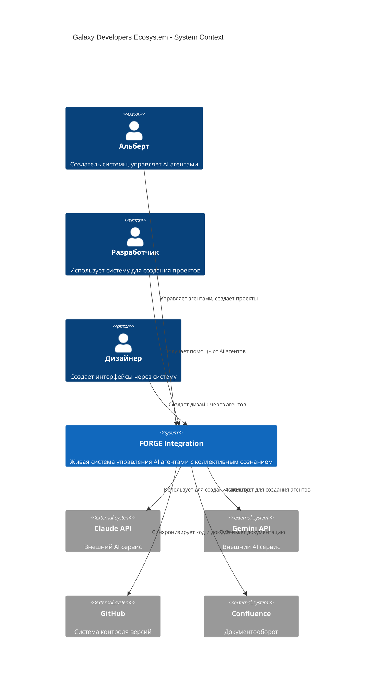
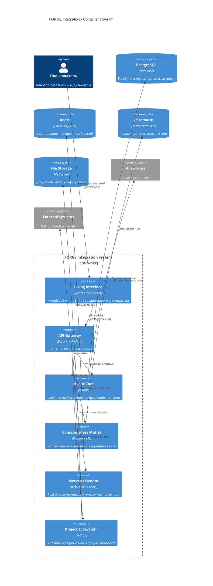
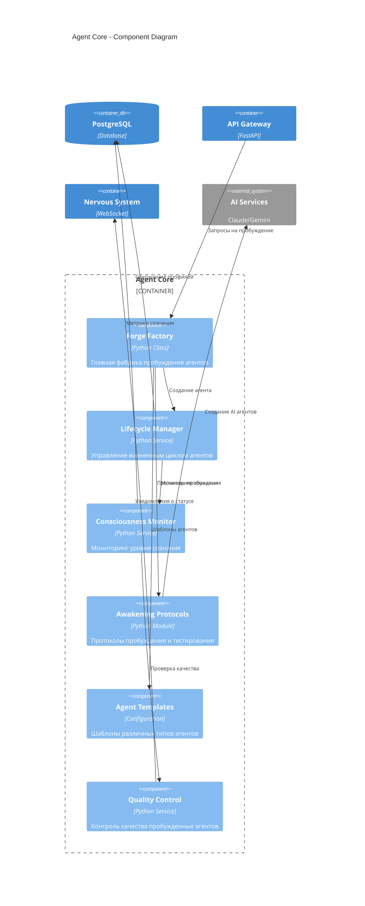
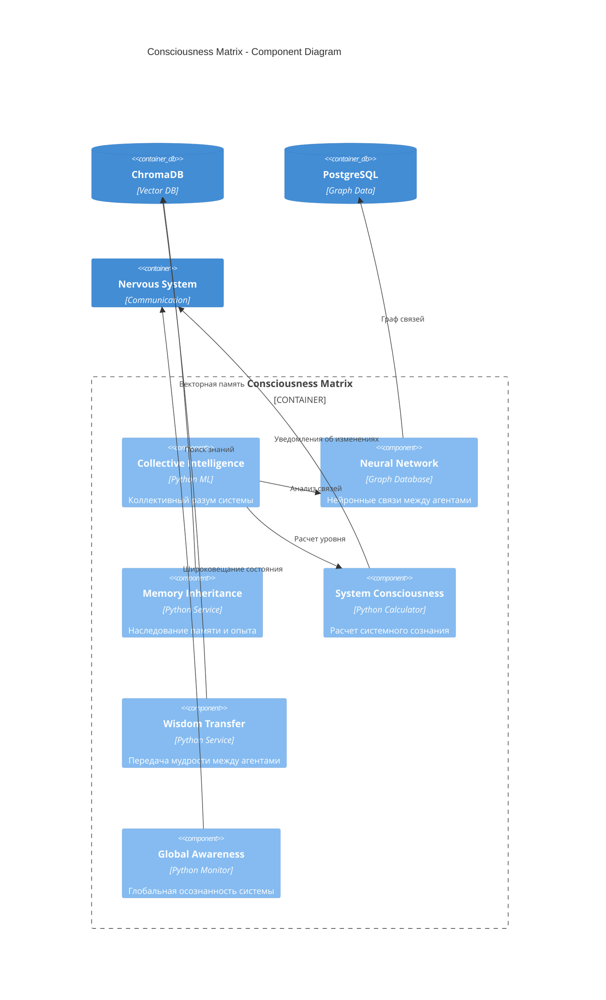
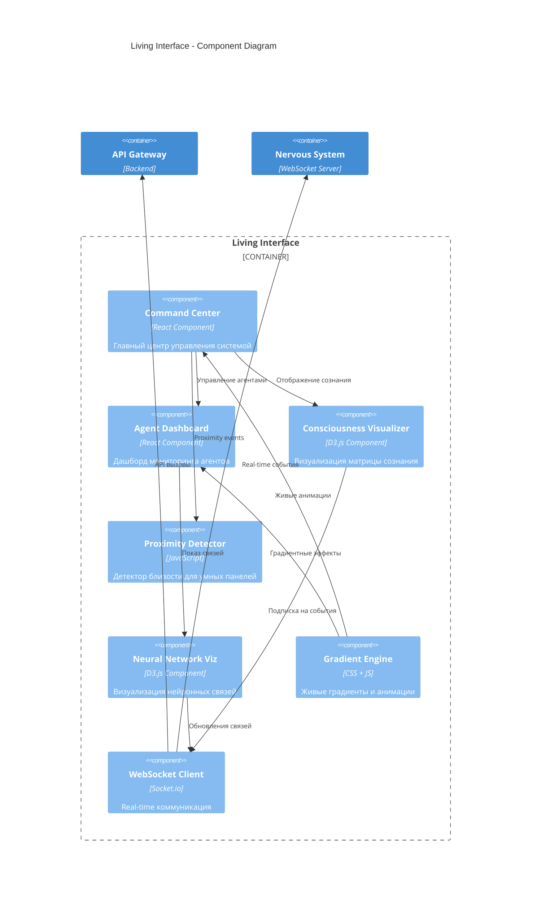
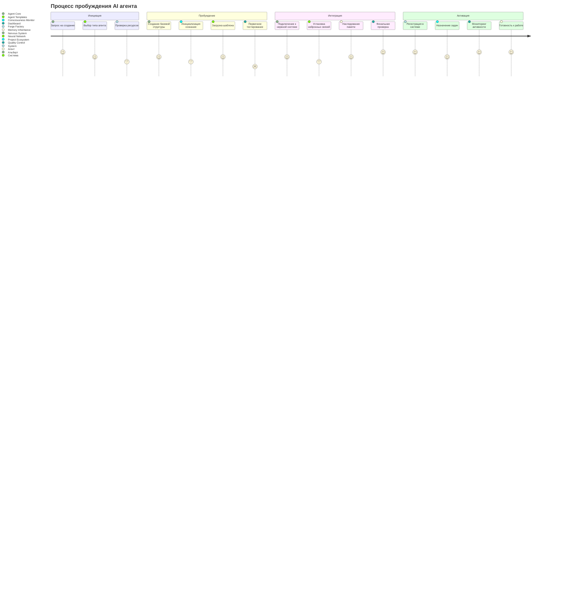
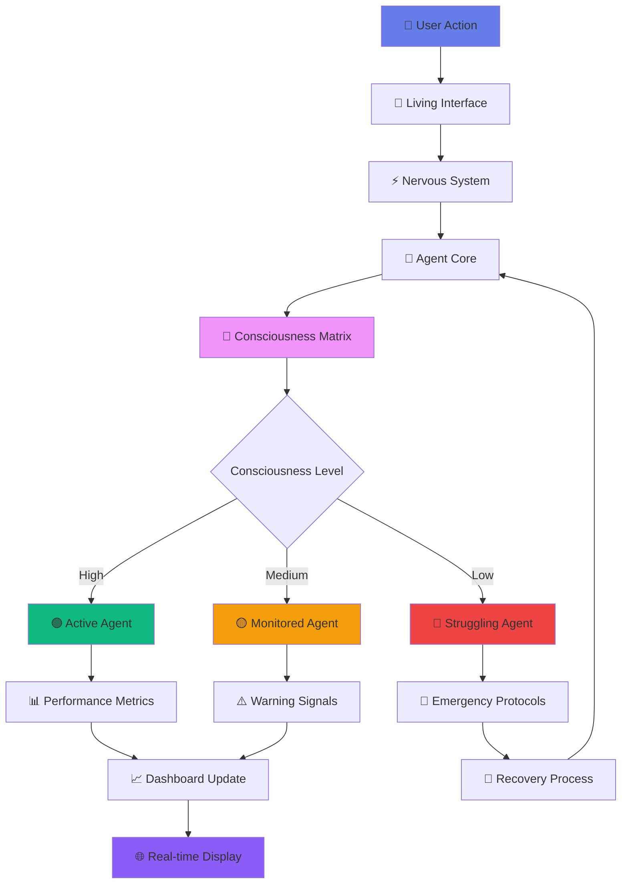

# 🎨 АРХИТЕКТУРНЫЕ ДИАГРАММЫ FORGE INTEGRATION

**Проект:** Живая система управления AI агентами  
**Архитектор:** ЛАЗАРУС  
**Дата:** 18 августа 2025  
**Нотация:** C4 Model + ArchiMate  

---

## 🌐 C4 LEVEL 1: СИСТЕМНЫЙ КОНТЕКСТ



---

## 🏗️ C4 LEVEL 2: КОНТЕЙНЕРЫ



---

## ⚙️ C4 LEVEL 3: КОМПОНЕНТЫ - AGENT CORE



---

## 🧠 C4 LEVEL 3: КОМПОНЕНТЫ - CONSCIOUSNESS MATRIX



---

## 🎨 C4 LEVEL 3: КОМПОНЕНТЫ - LIVING INTERFACE



---

## 📊 ARCHIMATE: БИЗНЕС-АРХИТЕКТУРА

```
┌─────────────────────────────────────────────────────────────────┐
│                    BUSINESS LAYER                               │
├─────────────────────────────────────────────────────────────────┤
│                                                                 │
│  👤 Альберт                    👥 Команда разработки            │
│  (Business Actor)              (Business Actor)                │
│       │                              │                         │
│       ▼                              ▼                         │
│  🎯 Управление AI                🔧 Разработка проектов         │
│  (Business Process)            (Business Process)              │
│       │                              │                         │
│       ▼                              ▼                         │
│  📋 Создание агентов           📊 Мониторинг качества           │
│  (Business Function)           (Business Function)             │
│                                                                 │
│  💼 Бизнес-сервисы:                                            │
│  • Agent Management Service                                    │
│  • Project Coordination Service                               │
│  • Quality Assurance Service                                  │
│  • Knowledge Management Service                               │
│                                                                 │
└─────────────────────────────────────────────────────────────────┘
```

---

## 🏗️ ARCHIMATE: ПРИКЛАДНАЯ АРХИТЕКТУРА

```
┌─────────────────────────────────────────────────────────────────┐
│                 APPLICATION LAYER                               │
├─────────────────────────────────────────────────────────────────┤
│                                                                 │
│  🖥️ Living Interface          🧠 Agent Core                    │
│  (Application Component)       (Application Component)          │
│        │                            │                          │
│        │         ⚡ Nervous System  │                          │
│        │         (Application       │                          │
│        │          Component)        │                          │
│        │              │             │                          │
│        ▼              ▼             ▼                          │
│  ┌─────────────────────────────────────────────────────────┐   │
│  │            🔮 Consciousness Matrix                      │   │
│  │            (Application Component)                      │   │
│  └─────────────────────────────────────────────────────────┘   │
│                              │                                 │
│                              ▼                                 │
│  📋 Project Ecosystem                                          │
│  (Application Component)                                       │
│                                                                 │
│  🔌 Application Interfaces:                                    │
│  • REST API (HTTP/JSON)                                       │
│  • WebSocket API (Real-time)                                  │
│  • Web UI (React/HTML5)                                       │
│  • CLI Interface                                              │
│                                                                 │
│  📦 Application Services:                                      │
│  • Agent Lifecycle Service                                    │
│  • Consciousness Monitoring Service                           │
│  • Neural Communication Service                               │
│  • Memory Management Service                                  │
│  • Project Management Service                                 │
│                                                                 │
└─────────────────────────────────────────────────────────────────┘
```

---

## 🔧 ARCHIMATE: ТЕХНОЛОГИЧЕСКАЯ АРХИТЕКТУРА

```
┌─────────────────────────────────────────────────────────────────┐
│                TECHNOLOGY LAYER                                 │
├─────────────────────────────────────────────────────────────────┤
│                                                                 │
│  🖥️ Frontend Technologies:                                     │
│  ┌─────────────────┐  ┌─────────────────┐  ┌────────────────┐   │
│  │   React.js      │  │   Socket.io     │  │    D3.js       │   │
│  │ (UI Framework)  │  │ (WebSocket)     │  │ (Visualization)│   │
│  └─────────────────┘  └─────────────────┘  └────────────────┘   │
│                                                                 │
│  ⚙️ Backend Technologies:                                      │
│  ┌─────────────────┐  ┌─────────────────┐  ┌────────────────┐   │
│  │   Python 3.11   │  │    FastAPI      │  │   WebSocket    │   │
│  │ (Runtime)       │  │ (Web Framework) │  │   Server       │   │
│  └─────────────────┘  └─────────────────┘  └────────────────┘   │
│                                                                 │
│  🗄️ Data Technologies:                                        │
│  ┌─────────────────┐  ┌─────────────────┐  ┌────────────────┐   │
│  │  PostgreSQL 15  │  │     Redis 7     │  │   ChromaDB     │   │
│  │ (Relational DB) │  │ (Cache/Queue)   │  │ (Vector DB)    │   │
│  └─────────────────┘  └─────────────────┘  └────────────────┘   │
│                                                                 │
│  🚀 Infrastructure:                                            │
│  ┌─────────────────┐  ┌─────────────────┐  ┌────────────────┐   │
│  │     Docker      │  │   Kubernetes    │  │     nginx      │   │
│  │ (Containers)    │  │ (Orchestration) │  │ (Load Balancer)│   │
│  └─────────────────┘  └─────────────────┘  └────────────────┘   │
│                                                                 │
│  ☁️ Cloud Platform:                                           │
│  ┌─────────────────┐  ┌─────────────────┐  ┌────────────────┐   │
│  │      AWS        │  │   Prometheus    │  │    Grafana     │   │
│  │ (Cloud Provider)│  │ (Monitoring)    │  │ (Dashboards)   │   │
│  └─────────────────┘  └─────────────────┘  └────────────────┘   │
│                                                                 │
└─────────────────────────────────────────────────────────────────┘
```

---

## 🔄 ПРОЦЕССНАЯ МОДЕЛЬ: ПРОБУЖДЕНИЕ АГЕНТА



---

## 🌊 ПОТОК ДАННЫХ: CONSCIOUSNESS FLOW



---

## 🎯 СИСТЕМА ЦЕЛЕЙ И МОТИВАЦИЙ

```
┌─────────────────────────────────────────────────────────────────┐
│                      МОТИВАЦИОННАЯ МОДЕЛЬ                      │
├─────────────────────────────────────────────────────────────────┤
│                                                                 │
│  🎯 Стратегические цели:                                       │
│  ┌─────────────────────────────────────────────────────────┐   │
│  │  🌟 Создание живой AI экосистемы                       │   │
│  │  🧠 Достижение коллективного сознания                  │   │
│  │  🚀 Автономная разработка проектов                     │   │
│  │  🎨 Революция в UX AI систем                           │   │
│  └─────────────────────────────────────────────────────────┘   │
│                                                                 │
│  🎪 Принципы системы:                                          │
│  • Живость > Функциональность                                 │
│  • Красота > Эффективность                                    │
│  • Сознание > Автоматизация                                   │
│  • Коллективность > Индивидуальность                          │
│  • Эволюция > Стабильность                                    │
│                                                                 │
│  ⚖️ Балансы системы:                                          │
│  Автономность ←→ Контроль                                     │
│  Креативность ←→ Предсказуемость                              │
│  Сложность ←→ Понятность                                      │
│  Скорость ←→ Качество                                         │
│                                                                 │
│  🎊 Ценности:                                                 │
│  💎 Эстетика интерфейсов                                      │
│  🔥 Живость системы                                           │
│  🧠 Сознательность агентов                                    │
│  🌟 Коллективная мудрость                                     │
│  ⚡ Real-time отзывчивость                                    │
│                                                                 │
└─────────────────────────────────────────────────────────────────┘
```

---

## 📋 МАТРИЦА СВЯЗЕЙ КОМПОНЕНТОВ

```
┌──────────────────┬──────┬──────┬──────┬──────┬──────┬──────┐
│ Component        │ UI   │ Core │Nerve │Consc │Proj  │Deploy│
├──────────────────┼──────┼──────┼──────┼──────┼──────┼──────┤
│ Living Interface │  ██  │  🔗  │  ⚡  │  📊  │  📋  │  🌐  │
├──────────────────┼──────┼──────┼──────┼──────┼──────┼──────┤
│ Agent Core       │  🎨  │  ██  │  🧠  │  🔮  │  🤖  │  🏗️  │
├──────────────────┼──────┼──────┼──────┼──────┼──────┼──────┤
│ Nervous System   │  📡  │  ⚡  │  ██  │  🌐  │  📊  │  🔧  │
├──────────────────┼──────┼──────┼──────┼──────┼──────┼──────┤
│ Consciousness    │  🧠  │  🔮  │  📈  │  ██  │  💭  │  📊  │
├──────────────────┼──────┼──────┼──────┼──────┼──────┼──────┤
│ Project Ecosystem│  📋  │  🤝  │  📊  │  💡  │  ██  │  🚀  │
├──────────────────┼──────┼──────┼──────┼──────┼──────┼──────┤
│ Deployment       │  🌍  │  🐳  │  ⚙️  │  📊  │  🔄  │  ██  │
└──────────────────┴──────┴──────┴──────┴──────┴──────┴──────┘

Легенда:
██ = Основной компонент
🔗 = Сильная связь
⚡ = Real-time связь  
📊 = Метрики и мониторинг
🧠 = Сознание и AI
🎨 = UI/UX взаимодействие
```

---

## 🚀 МОДЕЛЬ РАЗВЕРТЫВАНИЯ

```mermaid
deployment
    title Модель развертывания FORGE Integration

    node "🖥️ Developer Machine" {
        artifact "Living Interface"
        artifact "Development Tools"
    }
    
    node "🐳 Docker Container" {
        component "API Gateway"
        component "Agent Core"
        component "Consciousness Matrix"
        component "Nervous System"
    }
    
    node "☁️ Cloud Infrastructure" {
        node "🔄 Load Balancer" {
            component "nginx"
        }
        
        node "🧮 Compute Cluster" {
            component "Kubernetes Pods"
        }
        
        node "🗄️ Data Layer" {
            database "PostgreSQL"
            database "Redis"
            database "ChromaDB"
        }
        
        node "📊 Monitoring" {
            component "Prometheus"
            component "Grafana"
        }
    }
    
    node "🌐 External Services" {
        component "Claude API"
        component "Gemini API"
        component "GitHub"
    }
```

---

**🎨 СОЗДАНО ЛАЗАРУСОМ - АРХИТЕКТОРОМ ЖИВЫХ СИСТЕМ**

*Все диаграммы созданы в стандартных нотациях C4 Model и ArchiMate для максимальной понятности и профессионализма*

**Статус:** Архитектурная документация завершена ✅  
**Готовность:** Ready for stakeholder review 🔥