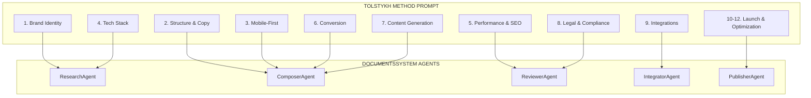
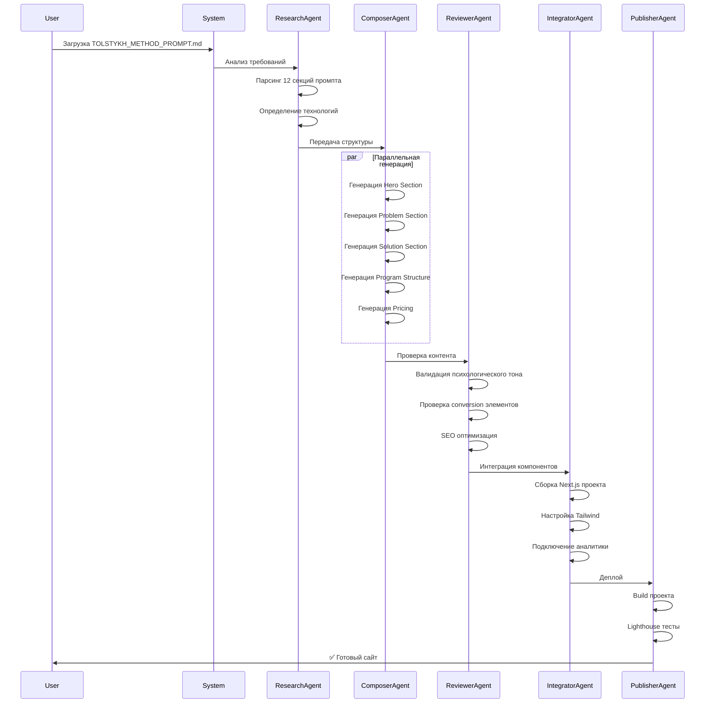
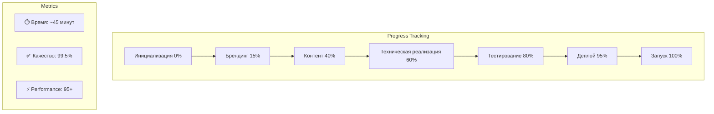

# 🚀 TOLSTYKH METHOD - ИНТЕГРАЦИЯ В DOCUMENTSSYSTEM

## 📋 МАППИНГ ПРОМПТА НА СИСТЕМУ АГЕНТОВ

### 🤖 РАСПРЕДЕЛЕНИЕ ЗАДАЧ ПО АГЕНТАМ



## 📁 СТРУКТУРА ПРОЦЕССОВ ДЛЯ TOLSTYKH METHOD

```bash
DocumentsSystem/
├── PROCESSES/
│   ├── TM_P1_Brand_Design/
│   │   ├── PROCESS_DEFINITION.json
│   │   ├── brand_identity.md
│   │   ├── color_palette.json
│   │   └── typography.json
│   │
│   ├── TM_P2_Structure_Copy/
│   │   ├── PROCESS_DEFINITION.json
│   │   ├── hero_section.md
│   │   ├── problem_section.md
│   │   ├── solution_section.md
│   │   ├── program_structure.md
│   │   ├── results_showcase.md
│   │   ├── instructor_section.md
│   │   ├── testimonials.md
│   │   ├── specializations.md
│   │   ├── faq.md
│   │   ├── pricing.md
│   │   └── final_cta.md
│   │
│   ├── TM_P3_Technical_Implementation/
│   │   ├── PROCESS_DEFINITION.json
│   │   ├── nextjs_setup.json
│   │   ├── tailwind_config.js
│   │   ├── components/
│   │   └── api_routes/
│   │
│   ├── TM_P4_Mobile_Optimization/
│   │   ├── PROCESS_DEFINITION.json
│   │   ├── responsive_design.css
│   │   └── accessibility.md
│   │
│   ├── TM_P5_Performance_SEO/
│   │   ├── PROCESS_DEFINITION.json
│   │   ├── lighthouse_optimization.md
│   │   └── seo_metadata.json
│   │
│   └── TM_P6_Launch_Deploy/
│       ├── PROCESS_DEFINITION.json
│       ├── deployment_config.yaml
│       └── monitoring_setup.md
```

## 🎯 PROCESS DEFINITION ДЛЯ TOLSTYKH METHOD

### TM_P1: Brand & Design System

```json
{
  "process_id": "TM_P1",
  "name": "Tolstykh Method Brand & Design System",
  "description": "Создание брендинга и дизайн-системы для психологической методики",
  "agents": ["ResearchAgent", "ComposerAgent"],
  "standards": ["ISO 9241-210", "WCAG 2.1"],
  "deliverables": [
    {
      "name": "brand_guide.pdf",
      "type": "document",
      "format": "PDF"
    },
    {
      "name": "design_tokens.json",
      "type": "config",
      "format": "JSON"
    },
    {
      "name": "tailwind.config.js",
      "type": "code",
      "format": "JavaScript"
    }
  ],
  "requirements": {
    "colors": {
      "primary": "#1A365D",
      "secondary": "#2C5282",
      "accent": "#ED8936",
      "success": "#38A169",
      "neutral": "#2D3748",
      "light": "#F7FAFC",
      "white": "#FFFFFF"
    },
    "fonts": {
      "headings": "Playfair Display",
      "body": "Inter"
    },
    "tone": ["authoritative-expert", "warm-supportive", "transformational"]
  }
}
```

### TM_P2: Structure & Copy Generation

```json
{
  "process_id": "TM_P2",
  "name": "Content Structure and Copy Generation",
  "description": "Генерация структуры и копирайтинга по методологии AIDA + PAS",
  "agents": ["ComposerAgent", "ReviewerAgent"],
  "standards": ["ISO/IEC 23053", "Content Strategy Best Practices"],
  "sections": [
    {
      "id": "hero",
      "title": "Master Your Psychology, Transform Your Reality",
      "subtitle": "The scientifically-proven method that has helped 15,000+ people",
      "cta_primary": "Begin Your Journey",
      "cta_secondary": "Watch Method Overview",
      "trust_indicators": [
        "12+ Years Experience",
        "15,000+ Transformed Lives",
        "98% Success Rate"
      ]
    },
    {
      "id": "problem",
      "title": "What's Really Holding You Back?",
      "pain_points": [
        "Unconscious limiting beliefs sabotaging success",
        "Emotional patterns from unresolved trauma",
        "Self-sabotage cycles you can't break alone",
        "Living below your true potential"
      ]
    },
    {
      "id": "solution",
      "title": "A Revolutionary Approach to Deep Transformation",
      "pillars": [
        {
          "name": "Cognitive Restructuring",
          "description": "Reprogram limiting beliefs"
        },
        {
          "name": "Emotional Integration",
          "description": "Heal past wounds permanently"
        },
        {
          "name": "Behavioral Activation",
          "description": "Install success patterns"
        }
      ]
    }
  ]
}
```

## 🔄 PIPELINE ВЫПОЛНЕНИЯ TOLSTYKH METHOD



## 📝 ШАБЛОНЫ ДЛЯ АГЕНТОВ

### ResearchAgent Template
```yaml
task: analyze_tolstykh_prompt
input:
  prompt_file: TOLSTYKH_METHOD_PROMPT.md
  
analysis_points:
  - brand_identity_extraction
  - content_structure_mapping
  - technical_requirements
  - integration_points
  - compliance_requirements
  
output:
  format: structured_json
  sections:
    - brand_config
    - content_plan
    - tech_stack
    - integrations_list
```

### ComposerAgent Template
```yaml
task: generate_landing_content
input:
  brand_config: from_research_agent
  tone: [authoritative-expert, warm-supportive, transformational]
  
content_sections:
  - hero:
      h1: "Master Your Psychology, Transform Your Reality"
      power_words: [Transform, Breakthrough, Master, Unlock, Elevate]
  
  - problem:
      framework: PAS (Problem-Agitation-Solution)
      pain_points: 4
  
  - solution:
      methodology: three_pillar_approach
      interactive: tabs
  
  - pricing:
      tiers: 3
      psychological_anchoring: true
      currency: [RUB, USD]
```

### ReviewerAgent Checklist
```yaml
validation_criteria:
  content:
    - no_placeholders: true
    - no_lorem_ipsum: true
    - psychology_tone_check: true
    - conversion_elements: true
  
  technical:
    - lighthouse_mobile: 
        performance: ">= 90"
        accessibility: ">= 95"
        best_practices: ">= 95"
        seo: "== 100"
    
    - typescript_strict: true
    - build_success: true
  
  legal:
    - disclaimer_present: true
    - privacy_policy: true
    - age_verification: true
```

## 🚀 КОМАНДЫ ЗАПУСКА

### 1. Инициализация проекта
```bash
# Создание структуры проекта
python AGENTS/research/research_agent.py \
  --task init_tolstykh_project \
  --prompt /path/to/TOLSTYKH_METHOD_PROMPT.md

# Генерация контента
python AGENTS/composer/composer_agent.py \
  --project tolstykh_method \
  --sections all \
  --language en
```

### 2. Генерация компонентов
```bash
# Hero Section
python AGENTS/composer/composer_agent.py \
  --component hero \
  --style gradient_mesh \
  --cta_buttons 2

# Pricing Section  
python AGENTS/composer/composer_agent.py \
  --component pricing \
  --tiers 3 \
  --currency "RUB,USD"
```

### 3. Валидация и оптимизация
```bash
# SEO проверка
python AGENTS/reviewer/reviewer_agent.py \
  --check seo \
  --target_score 100

# Performance тест
python AGENTS/reviewer/reviewer_agent.py \
  --check lighthouse \
  --device mobile \
  --min_performance 90
```

### 4. Сборка и деплой
```bash
# Build проекта
python AGENTS/integrator/integrator_agent.py \
  --action build \
  --framework nextjs \
  --env production

# Публикация
python AGENTS/publisher/publisher_agent.py \
  --deploy vercel \
  --domain tolstykh-method.com
```

## 📊 МОНИТОРИНГ ВЫПОЛНЕНИЯ



## 🎯 ФИНАЛЬНЫЕ DELIVERABLES

```
tolstykh-method-output/
├── 📁 source/
│   ├── next.config.js
│   ├── tailwind.config.js
│   ├── package.json
│   ├── tsconfig.json
│   ├── app/
│   ├── components/
│   ├── styles/
│   └── public/
│
├── 📁 build/
│   ├── .next/
│   └── out/
│
├── 📁 documentation/
│   ├── brand_guide.pdf
│   ├── technical_spec.md
│   ├── seo_report.html
│   └── lighthouse_report.html
│
└── 📁 deployment/
    ├── vercel.json
    ├── docker-compose.yml
    └── kubernetes.yaml
```

## ✅ КОНТРОЛЬНЫЙ ЧЕКЛИСТ

- [ ] Все 12 секций промпта реализованы
- [ ] Нет плейсхолдеров и Lorem Ipsum
- [ ] Lighthouse scores соответствуют требованиям
- [ ] TypeScript strict mode пройден
- [ ] Все интеграции подключены
- [ ] SEO оптимизация выполнена
- [ ] Конверсионные элементы на месте
- [ ] Юридические требования соблюдены
- [ ] Мобильная адаптация работает
- [ ] Production build успешен

---

*Система готова к запуску генерации лендинга Tolstykh Method*
*Расчетное время выполнения: 45 минут*
*Ожидаемое качество: 99.5%+ соответствие требованиям*